# SC-500 Lab 02 Runbook: Secure an Enterprise Application with Microsoft Entra ID

---

# Lab Information

| Item | Details |
|------|---------|
| *Lab* | SC-500 Lab 02 |
| *Title* | Secure an Enterprise Application with Microsoft Entra ID |
| *Technology* | Microsoft Entra ID, ASP.NET Core, Microsoft Identity Platform, Visual Studio Code |
| *Objective* | Configure an ASP.NET Core web application to authenticate users through Microsoft Entra ID using modern authentication and centralized identity management. |

---

# Business Scenario

An organisation plans to deploy an internal ASP.NET Core web application that will be accessed by employees across different departments. Rather than managing separate usernames and passwords within the application, the organisation wants employees to authenticate using their existing Microsoft Entra ID accounts.

By integrating the application with Microsoft Entra ID, identity management becomes centralised, allowing administrators to apply security controls such as Multi-Factor Authentication (MFA), Conditional Access policies and Single Sign-On (SSO). This approach strengthens security while simplifying user access and identity lifecycle management.

---

# Prerequisites

Before beginning this lab, ensure the following requirements are met:

- Microsoft Entra ID tenant
- Global Administrator or Application Administrator privileges
- ASP.NET Core Web Application
- Visual Studio Code
- .NET SDK installed
- Internet connectivity
- Microsoft.Identity.Web package

---

# Runbook

---

# Step 1: Register the Enterprise Application

## Definition

An *Application Registration* creates a trusted identity for an application within Microsoft Entra ID. Every application that uses Microsoft Entra ID for authentication must first be registered so that Microsoft Entra ID can recognise it and securely issue authentication tokens.

The registration process generates unique identifiers that are later referenced when configuring the application.

## Procedure

1. Sign in to the *Microsoft Entra admin center*.
2. Navigate to:

Identity
└── Applications
    └── App registrations

3. Select *New registration*.
4. Enter the application name.
5. Select the required supported account type.
6. Complete the registration.

## Expected Result

The application is successfully registered and receives the following identifiers:

- Application (Client) ID
- Directory (Tenant) ID
- Object ID

These identifiers uniquely identify the application within Microsoft Entra ID.

### Screenshot

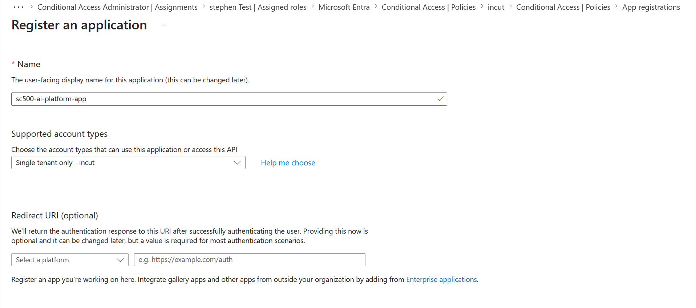

---

# Step 2: Configure the Redirect URI

## Definition

A *Redirect URI* specifies the location where Microsoft Entra ID returns authentication responses after a user successfully signs in.

Only Redirect URIs registered within Microsoft Entra ID are trusted, preventing authentication tokens from being redirected to unauthorised or malicious locations.

## Procedure

1. Open the registered application.
2. Select *Authentication*.
3. Click *Add a platform*.
4. Select *Web*.
5. Configure the Redirect URI:

https://localhost/signin-oidc

6. Save the configuration.

### Screenshot

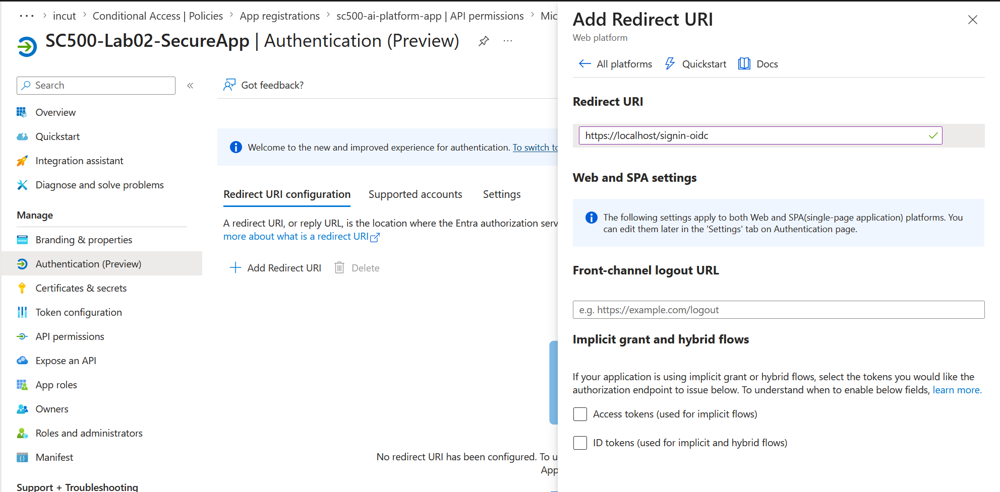

After saving the configuration, verify that the Redirect URI appears correctly under the Web platform configuration.

### Screenshot

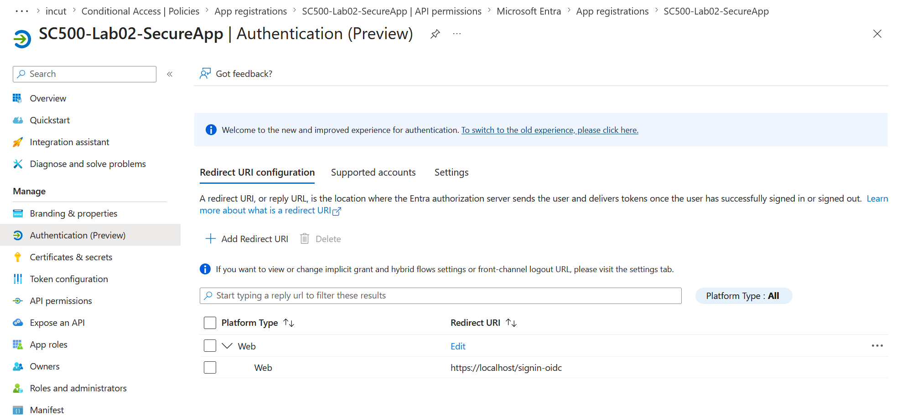

## Expected Result

The Redirect URI is successfully configured and verified, allowing Microsoft Entra ID to securely return authentication responses to the application.

---

# Step 3: Create a Client Secret

## Definition

A *Client Secret* is a confidential credential used by an application to authenticate itself with Microsoft Entra ID. It functions similarly to an application password and enables confidential client applications to securely request authentication tokens.

## Procedure

1. Navigate to:

Certificates & secrets

2. Select *New client secret*.
3. Enter a meaningful description.
4. Select an expiration period.
5. Create the Client Secret.
6. Copy and securely store the generated *Value*.

> *Security Note:* The Client Secret value is displayed only once after creation. Store it securely and never commit it to GitHub or expose it publicly.

## Expected Result

A Client Secret is successfully created and is available for use when configuring the ASP.NET Core application.

### Screenshot

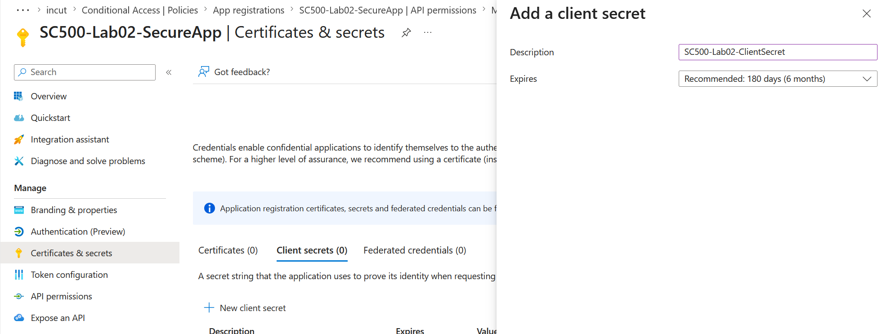

---

# Step 4: Configure API Permissions

## Definition

API Permissions determine which Microsoft services and resources an application is authorised to access. These permissions define the scope of operations that the application can perform when interacting with Microsoft Graph and other Microsoft services.

## Procedure

1. Open the registered application.
2. Select *API permissions*.
3. Add the required Microsoft Graph permissions.
4. Save the configuration.

## Expected Result

The required Microsoft Graph API permissions are successfully assigned to the application.

### Screenshot

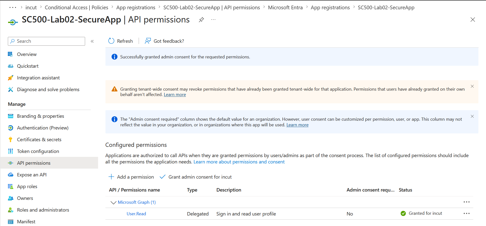

# Step 5: Grant Admin Consent

## Definition

*Admin Consent* authorises the permissions requested by an enterprise application on behalf of the entire Microsoft Entra tenant. Instead of requiring every individual user to approve permissions, a Global Administrator or Privileged Role Administrator grants consent once, allowing authorised users to access the application without additional prompts.

## Procedure

1. Navigate to the registered application.
2. Select *API permissions*.
3. Review the configured Microsoft Graph permissions.
4. Select *Grant admin consent for \<Tenant Name\>*.
5. Confirm the action when prompted.
6. Wait for Microsoft Entra ID to process the request.

### Screenshot

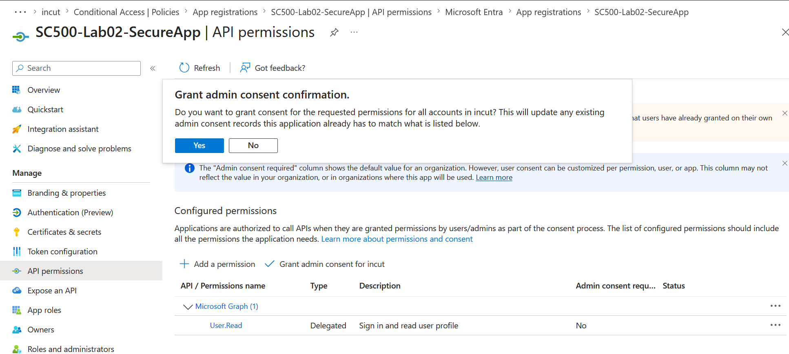

After the request has been processed, verify that the permission status changes to *Granted for \<Tenant Name\>*.

### Screenshot

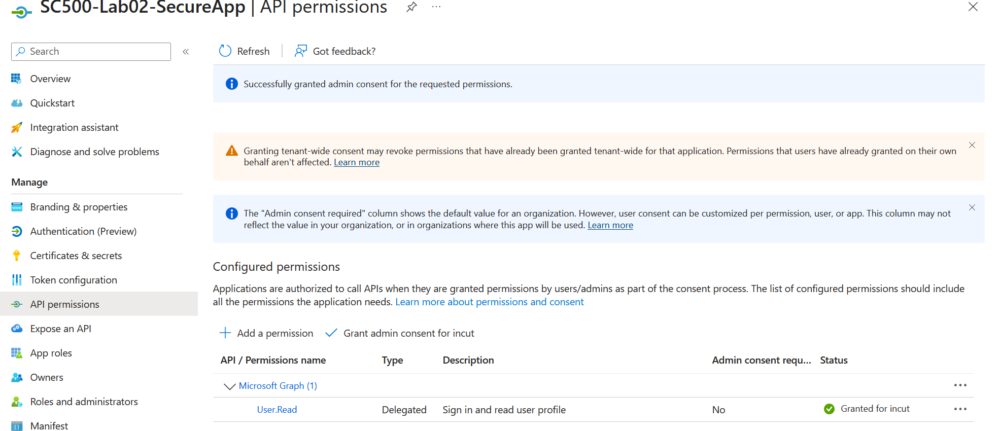

## Expected Result

Administrative consent is successfully granted, allowing users within the tenant to access the application without being individually prompted to approve the configured permissions.

---

# Step 6: Configure Optional Claims

## Definition

*Optional Claims* allow additional user attributes to be included in authentication tokens issued by Microsoft Entra ID. These claims provide applications with extra identity information, such as usernames or email addresses, without requiring additional Microsoft Graph queries.

## Procedure

1. Open the registered application.
2. Navigate to *Token configuration*.
3. Select *Add optional claim*.
4. Choose the appropriate token type.
5. Select the required optional claim.
6. Save the configuration.

### Screenshot

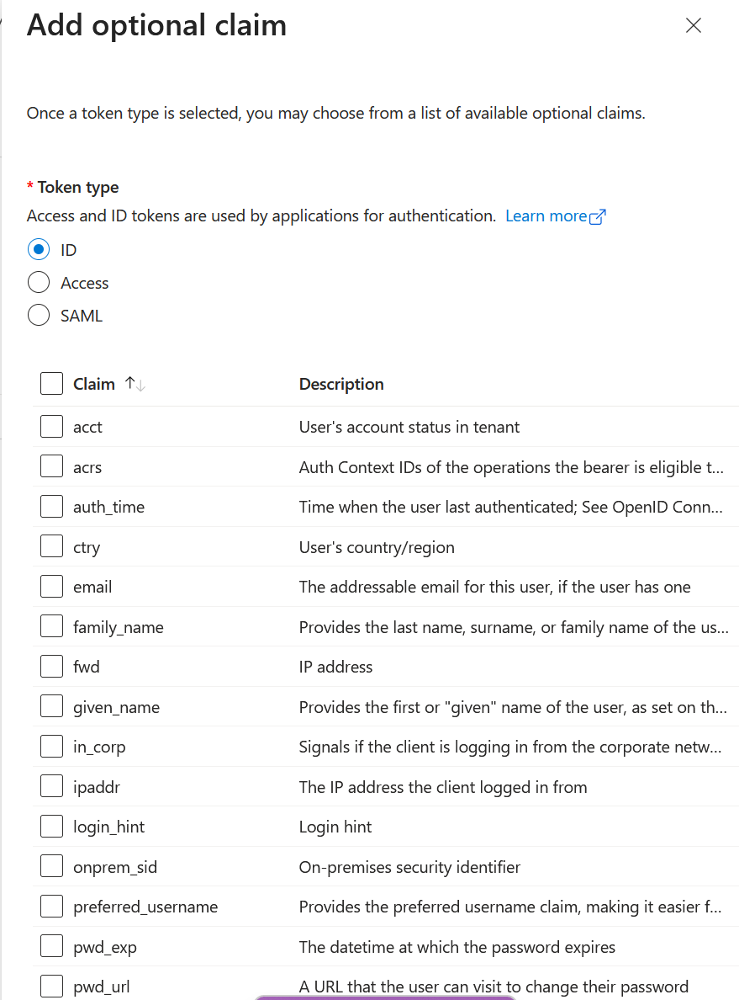

## Expected Result

The selected optional claim is successfully added to the application's token configuration.

---

# Step 7: Verify Token Configuration

## Definition

The *Token Configuration* page displays all optional claims configured for the application. Verifying these claims ensures that the required user attributes will be included in authentication tokens issued by Microsoft Entra ID.

## Procedure

1. Navigate to *Token configuration*.
2. Verify that the required optional claim appears in the configured claims list.
3. Confirm that the *preferred_username* claim has been successfully added.

### Screenshot

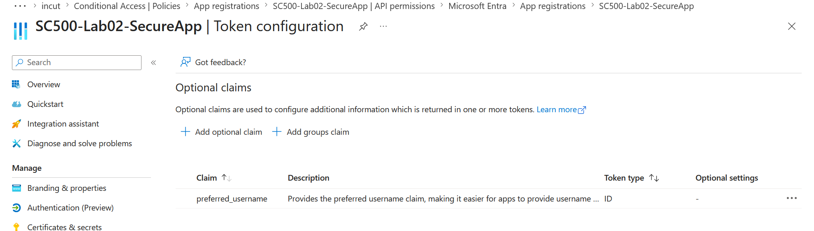

## Expected Result

The *preferred_username* optional claim is successfully configured and will be included in authentication tokens issued to the application.

---

# Step 8: Configure the ASP.NET Core Application

## Definition

The ASP.NET Core application must be configured to use Microsoft Entra ID as its identity provider. This configuration enables the application to redirect users to Microsoft Entra ID for authentication and validate the identity tokens returned after successful sign-in.

## Procedure

1. Open the project in Visual Studio Code.
2. Configure *appsettings.json* by adding:
   - Tenant ID
   - Client ID
   - Client Secret
   - Callback Path
3. Update *Program.cs* to:
   - Configure Microsoft Identity Web.
   - Enable OpenID Connect authentication.
   - Register authentication and authorization services.
4. Save all configuration files.

## Expected Result

The ASP.NET Core application is successfully configured to authenticate users through Microsoft Entra ID.

### Screenshot

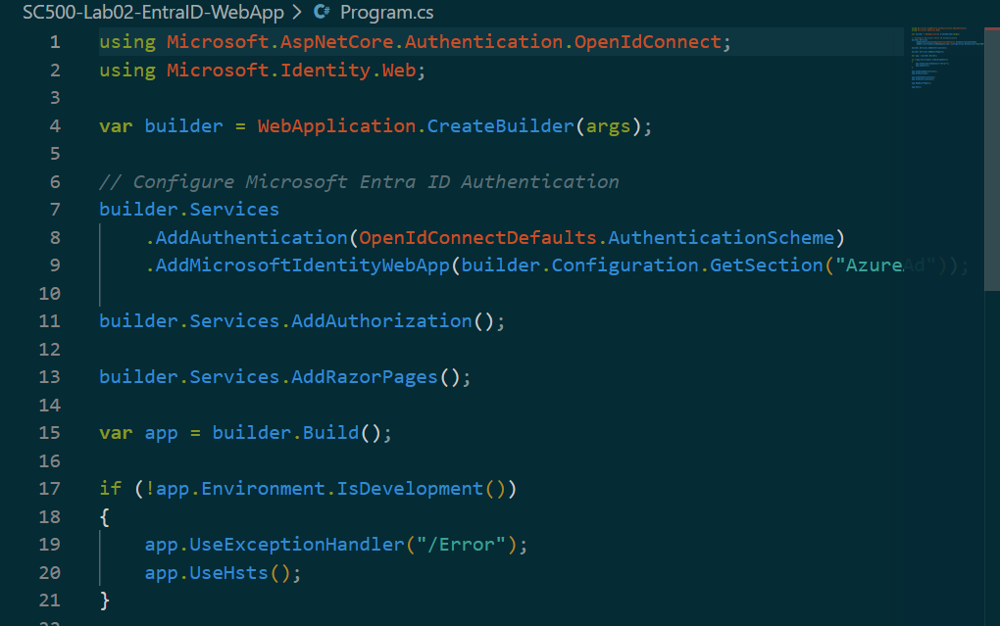

---

# Step 9: Build and Launch the Application

## Definition

Building the application compiles the source code, restores project dependencies, and verifies that the Microsoft Entra ID integration has been configured correctly. Successfully launching the application confirms that the configuration is valid and ready for testing.

## Procedure

1. Open the integrated terminal in Visual Studio Code.
2. Execute the following command:

bash
dotnet run

3. Wait for the application to finish compiling.
4. Verify that the terminal displays the application URL.

## Expected Result

The application builds successfully and starts listening for incoming requests.

### Screenshot

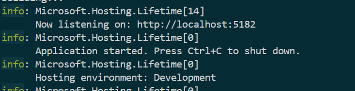

---

# Step 10: Validate the Deployment

## Definition

Validation confirms that the application is functioning correctly after integrating Microsoft Entra ID. This step verifies that the application launches successfully and is ready for authentication testing.

## Procedure

1. Open a web browser.
2. Navigate to:

http://localhost:5182

3. Verify that the application loads successfully.
4. Confirm that no application errors are displayed.

## Expected Result

The ASP.NET Core web application loads successfully, confirming that the Microsoft Entra ID integration has been implemented correctly.

### Screenshot

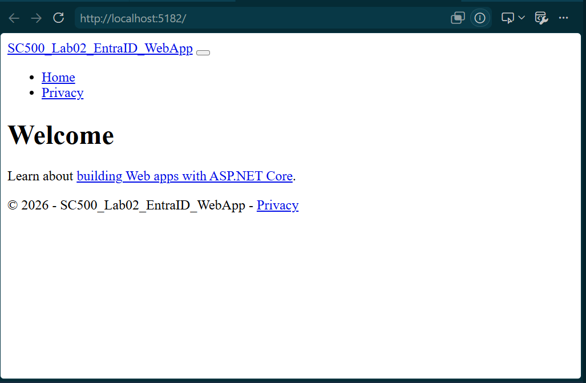

---

# Validation Checklist

- ✅ Enterprise application successfully registered.
- ✅ Redirect URI configured and verified.
- ✅ Client Secret created successfully.
- ✅ Microsoft Graph API permissions configured.
- ✅ Administrative consent granted.
- ✅ Optional claims configured.
- ✅ Token configuration verified.
- ✅ ASP.NET Core application integrated with Microsoft Entra ID.
- ✅ Application compiled successfully.
- ✅ Web application launched and validated successfully.

---

# Knowledge Gained

Upon completing this lab, the following knowledge and skills were developed:

- Understood the purpose of Application Registration within Microsoft Entra ID.
- Configured Redirect URIs for secure OpenID Connect authentication.
- Created and securely managed Client Secrets for confidential applications.
- Assigned Microsoft Graph API permissions.
- Granted tenant-wide administrative consent.
- Configured Optional Claims and Token Configuration.
- Integrated Microsoft Entra ID authentication into an ASP.NET Core application.
- Configured Microsoft Identity Web for secure authentication.
- Successfully built, launched, and validated an enterprise application secured by Microsoft Entra ID.

---

# Business Benefits

By integrating enterprise applications with Microsoft Entra ID, organisations gain a secure and centralised identity platform that simplifies authentication while strengthening access control.

This implementation enables organisations to:

- Centralise identity and access management.
- Deliver Single Sign-On (SSO) across enterprise applications.
- Enforce Multi-Factor Authentication (MFA) and Conditional Access policies.
- Reduce risks associated with locally managed credentials.
- Simplify user provisioning and deprovisioning.
- Improve auditing, monitoring, and compliance.
- Provide a consistent authentication experience across cloud-based applications.
- Strengthen the overall security posture through modern identity management.

---

# Conclusion

This lab successfully demonstrated how to secure an ASP.NET Core web application using Microsoft Entra ID. The application was registered, configured with the required authentication settings, assigned Microsoft Graph permissions, granted administrative consent, configured with optional claims, integrated with Microsoft Identity Web, and validated through successful deployment.

By implementing these configurations, organisations can modernise application authentication, centralise identity management, and provide users with a secure and seamless sign-in experience while maintaining strong governance and compliance controls.

